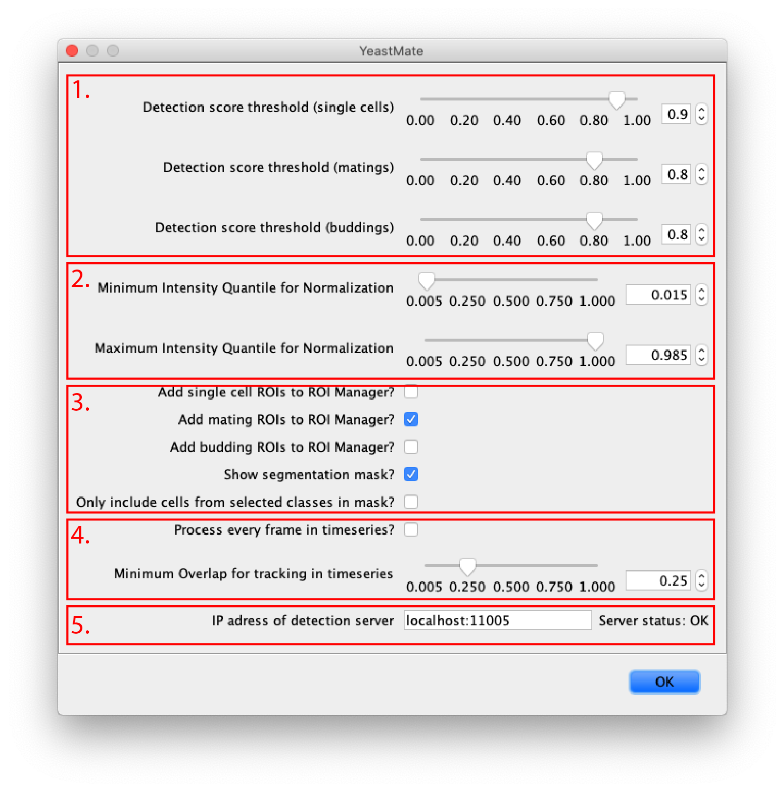

# How to use the YeastMate Fiji plugin

You can download the Fiji plugin from [https://github.com/hoerlteam/YeastMateFiji/releases](https://github.com/hoerlteam/YeastMateFiji/releases). Just put the single ```.jar``` file into the ```plugins``` folder of you Fiji installation and YeastMate should appear under ```Plugins->YeastMate``` the next time you start Fiji.

The Fiji plugin requires a running instance of the detection backend. You can start the packaged detection backend from within the main GUI ([see GUI: Getting Started](./gui.md)) or directly start it with the yeastmate_server executable in the YeastMate installation folder in ```resources->python->YeastMate```. 

Alternatively, you can start the detection backend from the command line with ```python yeastmate_server.py``` after setting up the required Python environment as described in ([Python - Get Started](./python.md)).

## Usage

The YeastMate Fiji plugin will perform detection in the **currently selected image** in Fiji. If the current image is a hyperstack, we will use the currently selected channel, timepoint and z-slice. After clicking ```Plugins->YeastMate``` in the Fiji menu, the following main dialog will appear:

# 

 1. **Detection score threshold:** the first options allow setting a score threshold for single cells, matings and buddings. Only objects for which our network predicts a score above the threshold will be considered. In practice, we found the values of 0.9 (single cells) and 0.75 (matings and buddings) to work well. You can, however, lower the thresholds to detect more objects, at the risk of more false positives, or raise the threshold to only consider objects for which the network is very sure, at the risk of false negatives.
 2. **Normalization quantiles:** Before passing images to the network, YeastMate will normalize the intensities of your images. To mitigate effects of single bright or dark pixels, we normalize not the the minimum and maximum intensity, but a low and high quantile of the intensities in your image. The default values of **0.015 and 0.985** should work fine for most images.
 3. **Output to display:** The checkboxes on the bottom half of the dialog allow you to specify what output to produce. You can select to **add YeastMate's detections to the Fiji ROI Manger** (single cells and mothers/daughters from transition events will be added as outlines and the whole matings/buddings as bounding boxes). You can also **display the single cell segmentation mask** as a new image (and optionally **limit the cells shown in the mask** to those participating in transitions which you selected to be added to the ROI Manger, e.g. if you only add buddings to the ROI Manager, only masks for mother and daughter cells involved in budding events will be shown).
 4. **IP of detection server:** The Fiji plugin requires the detection backend to be running in the background and will communicate with it using HTTP requests. On the bottom of the dialog, you can specify the IP adress and port of your detection backend (if you started the local backend from our all-in-one application, it should be ```localhost:11005```). Next to the textbox, a status message will indicate if the YeastMate detection server is rechable at the specified address.

 After setting the parameters, click **OK** to start detection.
 After a few seconds, the results you selected should pop up.

## Macro usage

If you activate Fiji's Macro Recorder from the main menu (```Plugins->Macros->Record...```), the command for YeastMate will be recorded and you can use it in macros, e.g. to process many images sequentially.

## Example Output

**Example: Segmentation mask:**
# 

**Example: ROIs for mating events:** 
# 