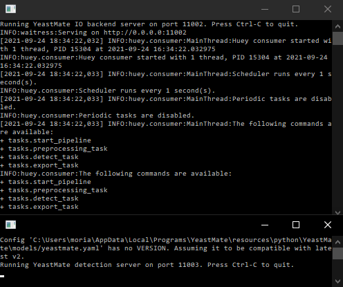
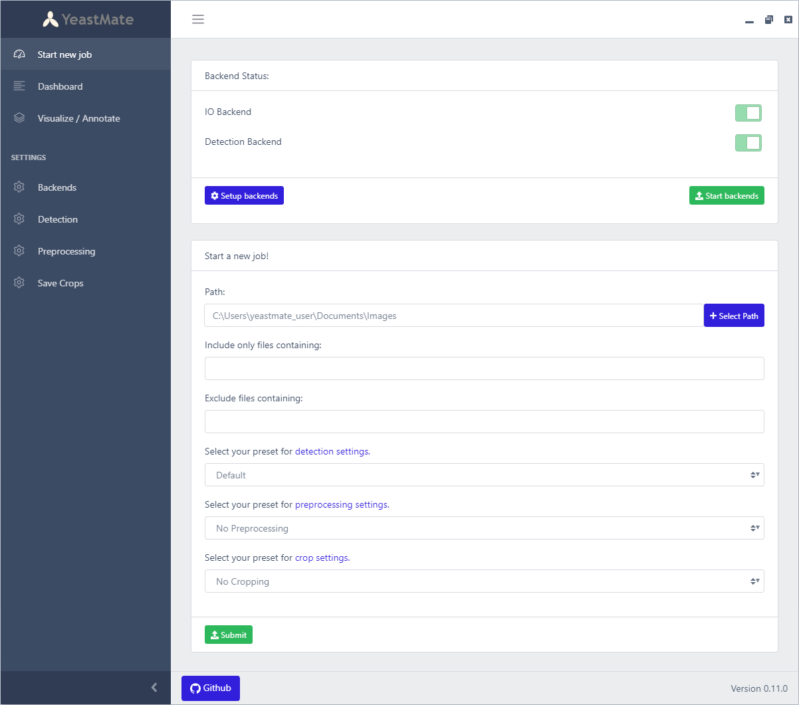
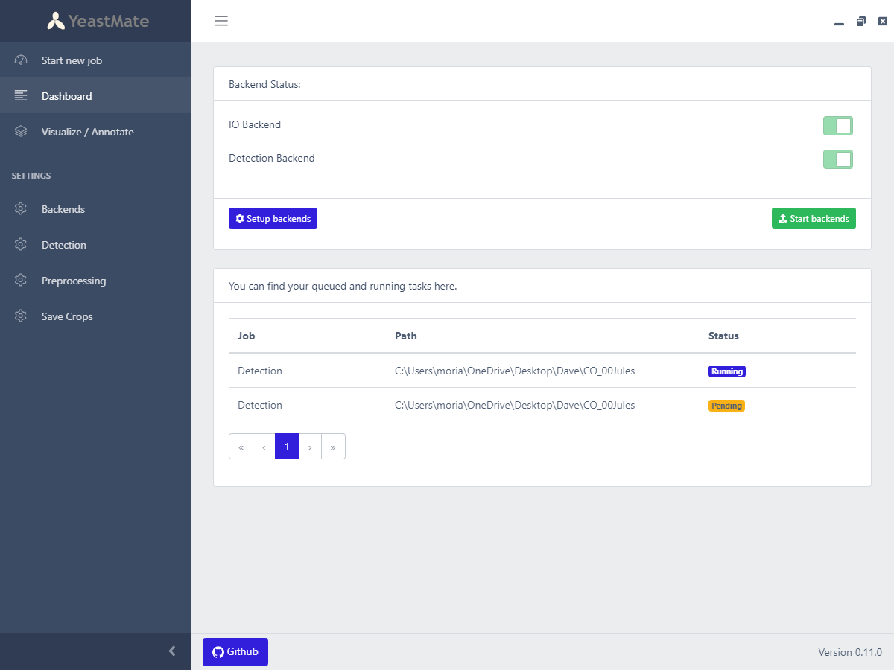
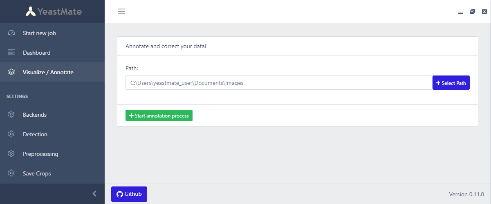

# How to use the YeastMate user interface

## Installing the standalone YeastMate application

YeastMate is available as a standalone application with prebuilt installers for Windows, Linux and Mac at [https://github.com/hoerlteam/YeastMate/releases](https://github.com/hoerlteam/YeastMate/releases) and [https://https://osf.io/287fr/](https://https://osf.io/287fr/) (faster download speed than Github). 

This will install the user interface, the Python data IO backend and the Python detection backend (with GPU acceleration on Nvidia CUDA-capable GPUs). The backends are packaged with PyInstaller with all their dependencies and don't require a Python installation on your system. Both backends can then be started from within the GUI.

The user interface and the packaged backends were tested on Windows 10, Ubuntu 18.04 and MacOS 11.5.2. Note that we currently do not support GPU-accelerated detection on Nvidia Ampere graphic cards (Geforce 30XX).

**Note:** Both macOS and Windows10 might show a warning the first time you run YeastMate, as it is an unsigned application. On Windows, you can choose to open the application regardless in the advanced settings of the dialog. On macOS, follow the instructions at [https://support.apple.com/guide/mac-help/open-a-mac-app-from-an-unidentified-developer-mh40616/mac](https://support.apple.com/guide/mac-help/open-a-mac-app-from-an-unidentified-developer-mh40616/mac) on how to open unsigned applications.

If any errors or bugs occur, you can report them at [https://github.com/hoerlteam/YeastMate/issues](https://github.com/hoerlteam/YeastMate/issues). 

YeastMate for Windows requires the Microsoft Visual C++ libraries. While these are usually already installed on most systems, you can download them [here](https://www.microsoft.com/en-US/download/details.aspx?id=26368) and [here](https://aka.ms/vs/16/release/vc_redist.x64.exe).

## Starting the application and backends

After running the installer, you can get right to processing your images by opening the YeastMate application. This will open the main user interface.

The actual processing of your images happens not within the user interface, but within two additional Python backend applications. These come packaged with the YeastMate application and can be started from the user interface. Alternatively, the backends can also be set up independently by yourself (see [Python - Get Started](./python.md)).

The user interface and the two backends communicate via HTTP requests and thus need to listen and send requests over some ports of your system. Depending on your system and firewall you might encounter a warning that YeastMate requests internet access. Unless you specifically tell YeastMate to use the internet to connect to a remote backend, YeastMate will NOT initiate any internet connection, and only communicate locally on your PC via these ports.

At the top of the GUI you will find a status display for the backends with a button to start the backends. These backends are automatically set up to run locally and start on an automatically found free port. Starting the backends will open two additional terminal windows, which will take a moment to initalize and start. A message in those terminal windows as well as the status block in the GUI will indicate when they're running and ready to go.

If you have set up external backends, you can point the GUI to these at the [Backend settings](./settings.md); else you can just start the local backends with the ```Start backends``` button. 

# 

## Starting a new detection job

After starting the YeastMate application, you will be on a landing page that allows you to start the IO and Detection backends (see above) and submit new jobs to it.

Set the path to the folder directly containing the images you want to process. YeastMate will not look into sub-directories, apart from a folder ```yeastmate-preprocessed``` which will contain the output of the preprocessing step if you use it.

You can also set tags to include or exclude files containing them, by default we exclude files containing ```_mask```, which will be generated automatically during detection.

# 

## Options

On the bottom of the card you can select the presets you set on their respective [settings pages](./settings.md) for three different jobs: 

* Detection: The main job which performs inference on your images and save a segmentation mask and additional detection metadata.

* Preprocessing: If your images are not tiff files, or you need to align your images, you can preprocess your data first, else you can skip this step.

* Export: If you want to further sort your detected objects or crop your images around specific objects, this job will perform additional export tasks.

### Input data format

YeastMate expects the input folder to contain TIFF files or a folder called ```yeastmate-preprocessed``` containing TIFF files. We support multiple channels or timepoints in files, in which case the dimension order should be TZCYX (default for TIFF images saved by ImageJ/Fiji). The TIFF files have to be uncompressed. If the dimension order of your images differs or they are compressed, you can optionally resave them in the correct format via the Preprocessing options.

### Output format

After YeastMate detects cells in your images, it will save the single cell instances segmentation masks as ```[input_file_name]_mask.tif``` as well as asignments of the individual cells to transition events in a JSON file called ```[input_file_name]_detections.json```, which has the following format:

```json
{
  "image": imagename, 
  "metadata": {
    "height": 1608,
    "width": 1608,
    "source": "Detection",                          # "Annotation" or "Detection"
    "detection_frame": {"t":"", "z":"", "c":""},    # position of 2D slice in image stacks
    "box_format": "x1y1x2y2"                        # YeastMate saves boxes in this format
  },
  "detections": {
    "1": {            # dictionary key is the same as the cells "id"
    "id": "1",        # unique id of the cell within the mask
    "box": [          # bounding box of the cell in the format "x1y1x2y2"
      664,
      102,
      717,
      156
      ],
    "class": [        # list of class labels of the cell
      "0",            # this object is a single cell ("0")
      "2.1"           # and also a budding-mother ("2.1", see below)
      ],
    "score": [
      0.982,          # score of the cell detection
      0.874           # each cell has a score for each class label
    ],
    "links": [
      "1001"          # id of the compound object this cell belongs to
      ]               # it can also belong to multiple compound objects
    }                 # compound objects will contain links to their cells
    ...
  }
}
```

The classes are structured as follows:

  * ```0```: single cell
  * ```1```: mating compound object
    * ```1.1```: mating - mother
    * ```1.2```: mating - daughter
  * ```2```: budding compound object
    * ```2.1```: budding - mother
    * ```2.2```: budding - daughter

The IDs of the compound object don't correspond to any values within the segmentation mask, their mask can be built from the segmentation of their individual cells.

## Job dashboard

# 

This page shows the status of the backends and all currently queued and running tasks.

## Correct and label your images

# 

This page allows you to inspect and correct the predicted objects and masks, or to annotate your images from scratch if you want to re-train the neural network. Given the path containing the images, it will open a separate [napari](https://napari.org) window. Note that only 2D images are currently supported.

Check [Label your images](./label.md) for more information on labelling your data.

### Retraining the model

You can start a training run of the model on your own data after annotating it like above. This may boost performance of the model on your specific dataset. You need to [install](./python.md) the Python module, and at least one fast GPU is recommended for acceptable training times.

Check [Python - Train on your data](./train.md) for more information on training on your data.

## Tracking in time series

If you want to detect cells in time series, note that the main YeastMate application will process all time points independently. If you want to track cells over time, we offer simple overlap-based tracking of the outputs of the standalone application through a Jupyter notebook [https://github.com/hoerlteam/YeastMate/blob/main/examples/tracking.ipynb](https://github.com/hoerlteam/YeastMate/blob/main/examples/tracking.ipynb) or through our [Fiji plugin](./fiji.md).

## Uninstalling YeastMate

* On Windows, the cleanest way to remove YeastMate is via the Control Panel under ```Programs > Programs and Features```.
* On macOS, you can just delete the YeastMate.app application.
* On Linux, uninstall with your distributions package manager.

