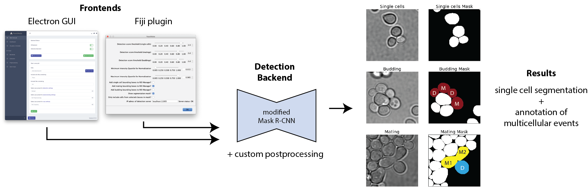

# 

YeastMate is a tool for the automated detection and segmentation of *S. cerevisae* cells and their mating and budding events, as well as a subclassification of the cells involved in these events into mother and daughter cells.

YeastMate uses a modified Mask R-CNN neural network for detection and segmentation and can be used as a standalone application with a graphical user interface, which is available as a prepackaged one-click installer without the need for Python or other dependencies. 

Alternatively, YeastMate can be used directly as a Python library or via an alternative Fiji plugin frontend.

The main code repository is available at [https://github.com/hoerlteam/YeastMate](https://github.com/hoerlteam/YeastMate/releases) and our image dataset is freely available at [https://https://osf.io/287fr/](https://https://osf.io/287fr/).

[Click here](./gui.md) to Get Started with the standalone application.

[Click here](./python.md) to Get Started with the Python module.

[Click here](./fiji.md) to Get Started with the Fiji plugin.
