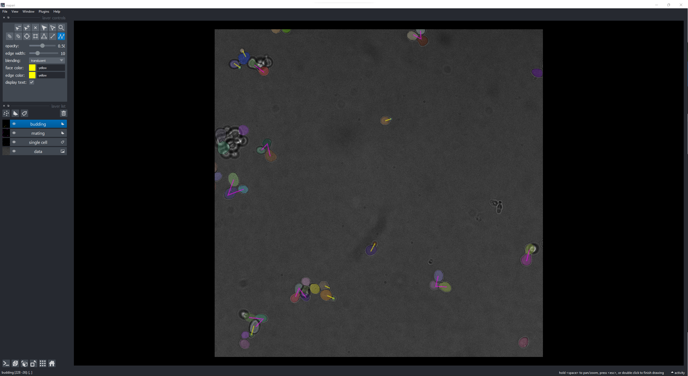
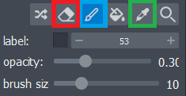
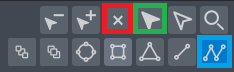

# Annotate your images

YeastMate comes with a custom annotation tool built upon [Napari](https://napari.org). It allows you to inspect and correct YeastMate's output as well as annotate your own images from scratch for re-training the detection model.

# 

After selecting your image path in the Visualize/Annotate page in the user interface, the button ```Start annotation process``` will open up a new Napari window.

It will automatically load all images directly within the set folder, but not images in sub-directories. If annotations in YeastMate's format exist (```_mask.tif``` files for the mask and ```_detections.json``` files for the detected objects), they will be loaded and shown as well.

Note that our annotation tool currently only supports 2D images.

## Navigating between images

You can navigate between images by pressing ```Enter``` to get to the next image, and pressing the ```left arrow key``` to go back to the previous image. Pressing ```S``` will save the changes you did to the annotation layers and write them to disk (also overwriting previous annotations).

If you did changes to the annotation layers and go to another image without saving, a window will appear asking you whether to save or discard your changes. If you choose to discard the changes, they will be gone, and going back to this image will load the original annotations (if they exist).

Holding ```Space``` will allow you to zoom in and out of your images with the mousewheel and move the image by dragging it.

## Annotating your images

The annotation process is split into two separate steps:

* Annotation of all cells by drawing a mask of each cell into a segmentation layer.

* Connecting cells that form zygotes or budding events.

If you annotate images from scratch, it is recommended to import a segmentation mask of all single cells and then manually correct it, as drawing the cell masks is the most time consuming part.

The masks are expected to be 2D images of the same shape as your images, with each cell mask having a unique, integer ID.



### The single cell mask

Click on the layer ```single cell``` to make changes to the mask layer. There are a few important tools to facilitate this step:



* The paint brush (blue) tool allows you to draw in your segmentations. ```Hotkey P```

* The eraser tool (red) allows you to erase existing segmentations. ```Hotkey E```

* The pipette tool (green) will set the current label to the label of the selected cell. ```Hotkey ?```

    * The label sets the cell ID that your paint brush will draw with (the eraser tool is not affected by this; it will erase everything, not just the selected label). If you correct specific cells, make sure to select their label first with the pipette tool. If you want to draw a new cell in, make sure to choose a label that is not used yet (e.g. start at a sufficiently high number if you correct existing annotations)

Each cell has to be drawn in separately; cells that are already merged (e.g. two mothers within a zygote) should also be labelled separately. Make sure to only label cells which you want YeastMate to recognize, for example exclude cells which are too far out of focus.

### Connecting cells 

Before you start connecting your cells, make sure that all the cells you want to connect are marked as an object in the single cell layer.

Click on the layer ```mating``` or ```budding``` to make changes to that specific layer. While selecting the ```mating``` layer, you can only add mating events and the other way around. There are a few important tools to facilitate this step:



* The path tool (blue) allows you to add connected points to the layer. ```Hotkey T```

* The select tool (green) allows you to select existing connections. ```Hotkey D```

* The delete tool (red) will delete the selected connection. ```Hotkey Del```

To connect cells, select the path tool and click on the cells after each other, and finish the connection by pressing ```Escape```. This will add a connection to the layer. The expected connections for the two layers are:

* Mating: The first two points should be the two mother cells, with an optional third point for the daughter cell if it exists.

* Budding: The first point should be the mother and the second point should be the daughter cell.

YeastMate strictly requires this connection scheme for custom training and will fail if there are more or less points than expected. In case of a budding zygote, add the mating and budding connections separately. A single cell can have multiple connections.

Make sure that each point of a connection lies within a segmented cell in the cell mask layer. If a point has no associated cell, an error message will appear when you try to save your annotation, giving you the chance to correct them.

## Useful Hotkeys

* Next Image      - ```Enter```
* Previous Image  - ```left arrow key```
* Save changes    - ```S```
* Move/Zoom       = ```Space```
* Paintbrush      - ```P```
* Eraser          - ```E```
* Connect cells     - ```T```
* Select label    - ```D```
* Erase selected  - ```Del```

## Start Napari from command line

To run the Napari tool yourself, download the [YeastMateBackend](https://github.com/hoerlteam/YeastMateBackend) repository and set up the Python environment as described in [Python - Installation](./environment.md).

You can then start the annotation process with:

``` bash
python annotation.py /PATH/TO/YOUR/IMAGES
```

It takes the following non-optional command line argument:

* ```--path``` : The path containing the images (and optionally annotations) that will be loaded.