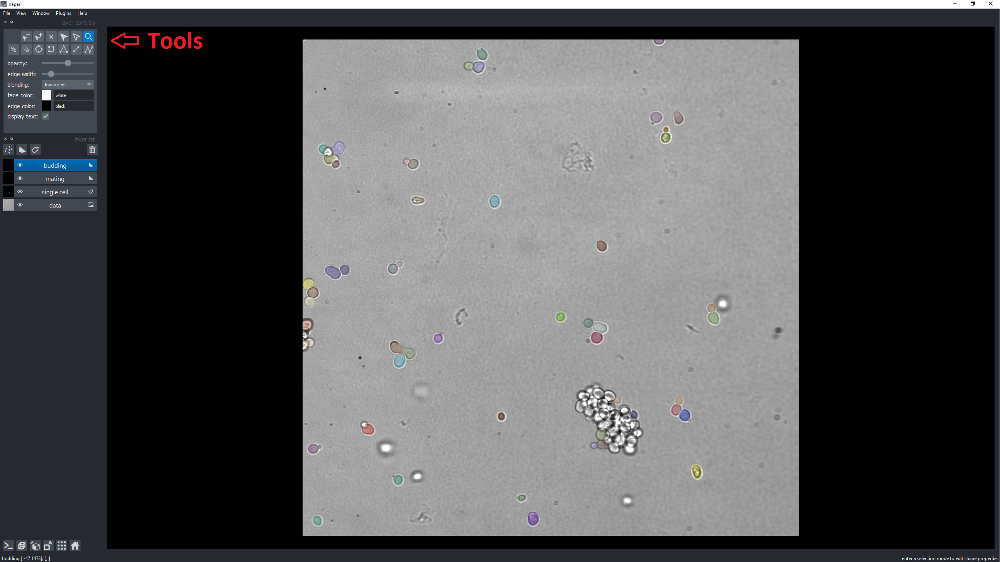

# Labeling

Instructions for using the labeling tools to correctly label the images and edit the single cell mask, as well as switching to the next image.

# The single cell mask

The single cell mask, the layer labeled as "single cell", is where all the cells should be marked. 
Make sure to only label the cells, which you want the program to recognize, for example exclude cells, which are too much out of focus.
To label a cell, firstly select the single cell layer. Once the layer is selected on the top left is a tool that looks like a paint brush. Either click on it or press the hotkey "P" to activate it.
Right below the paint brush is "label" with a number. This number is the ID of the cell. Make sure to not use the same ID for two different cells.
After you have selected the paint brush and an unused ID, you can simply paint the cell you want to add to the mask.
In order to remove a cell, use the tool "label eraser" (Hotkey: "E").

# Labeling the cells

Before you start labeling your cells, make sure that all the cells you want identified are marked as an object in the single cell layer.
Choose the correct layer (budding or mating) and then the right tool in the top left corner to label the involved cells (Also shown in the image below).
To label multiple cells, use the tool called "add path" (Hotkey: "T"). When you label a mating event with a daughter make sure to label both parents and then the daughter. Once you clicked on all cells belonging to the same event, press "Escape" to exit the "add path" tool.
Make sure the start and the end of all lines are inside the correct cells, so they get recognized by the program.
To delete a label, you have to first select it with the "select vertices" (Hotkey: "D") tool and then click on the "delete selected shapes" tool (Hotkey: "Del" or "Backspace")
If a line ends on the background instead of a cell, when trying to advance to the next image a keyerror will appear on the bottom right corner, showing a "0". In that case double check and correct all lines, which do not end on a marked cell.

# 

# Next image 
Once you are done with labeling all the mating and budding events, as well as correcting the mask, press "Enter" to advance to the next image.
As already mentioned before, if an error "0" appears, it means that a line ends outside of a labeled cell.

# Useful Hotkeys

Paintbrush      - "P"
Eraser          - "E"
Label cells     - "T"
Select label    - "D"
Erase selected  - "Del" or "Backspace"
Next Image      - "Enter"