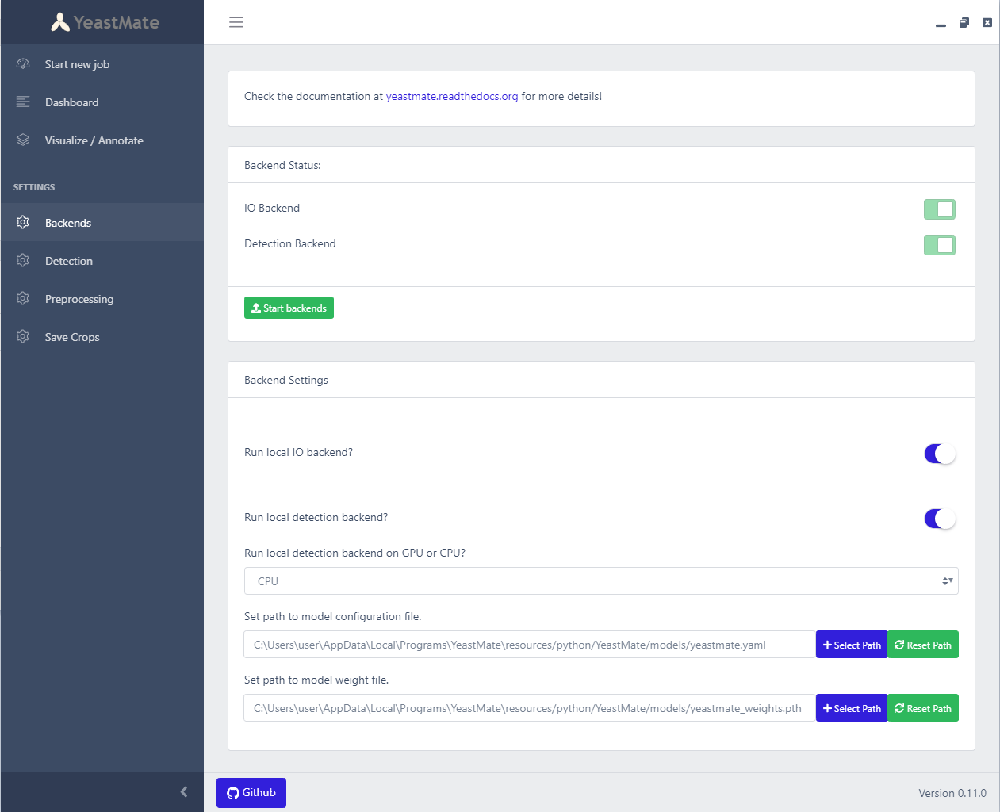
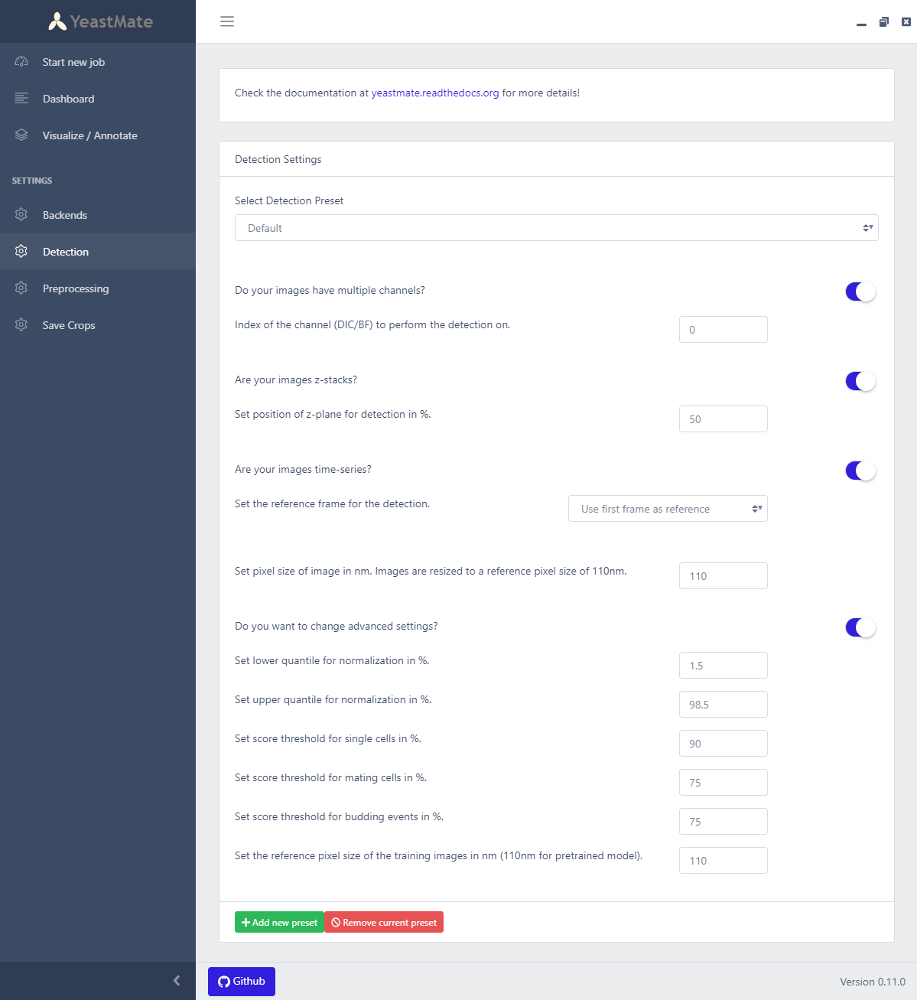
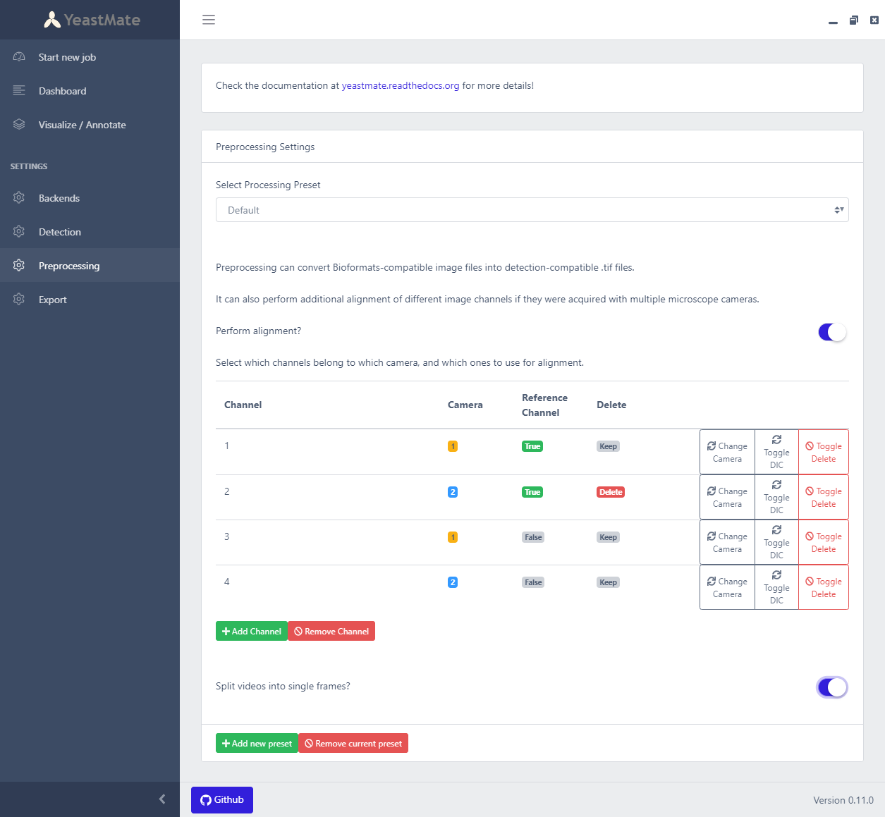
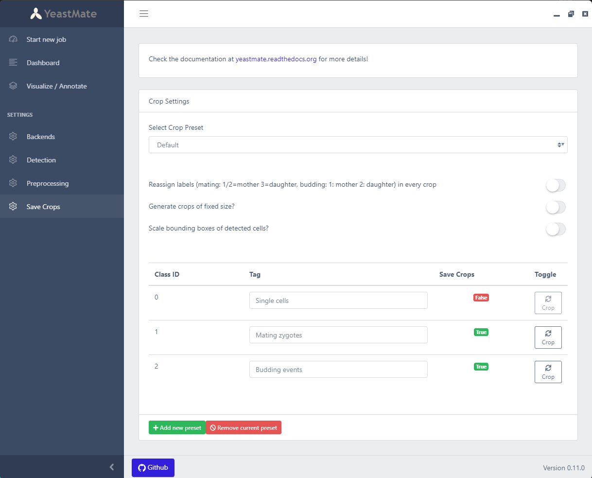

# Settings

All settings come with a default preset with standard values. This default preset will reset to the default settings each time you close and start YeastMate again. You can add new presets if you wish to save different settings for your different datasets. 

## Backend settings

Here you can set up the two backends that perform the actual tasks - the IO backend responsible for reading and preprocessing your data and saving the results, and the detection backend that contains the machine learning model.

Both backends can be run locally as prepackaged applications or be manually set up on remote servers. If you wish to run the local backends, leave the settings on local and click on ```Start backends```; this will open the two backends. If you run them remotely, you can set their remote IP and port here.

The local detection backend will run on GPU by default, unless your system does not have a CUDA compatible GPU, in which case the backend will default to CPU mode. In some cases, even a CUDA compatible GPU will not be compatible with YeastMate, which runs on CUDA 10.2. This is currently the case for the newest Ampere generation GPUs (e.g. RTX 3000 series), and some very old GPUs. A warning message will appear in the detection backend window if your GPU is not compatible, in which case you should change the device setting to ```CPU``` in the user interface.

# 

* If you run the IO backend not locally, you can uncheck this setting and set the external IP and port.

* If you run the detection backend not locally, you can uncheck this setting and set the external IP and port.

* If you run the detection backend locallym you can set some additional settings. If you run it manually, you can set these settings via command-line arguments.

* You can set the device the detection model runs on here.

* If you re-trained the detection model, you can set the path to your own config and model weights files.

## Detection settings

This page contains the various settings for the detection backend:

* YeastMate detects objects on a non-fluorescent DIC/Bright-Field overview channel. If your images have multiple channels, check this setting and set the channel to detect on.

* YeastMate performs detection on single-plane images. If your image is a z-stack, check this setting, and select where a single plane will be taken from the stack (e.g. 50% for the middle slice).

* If you wish to detect objects in a time-series, you can set the detection to be done on the first or last frame of your stack. If you wish to detect on every frame separately, please split your stack into single frames first (this can be set up in the preprocessing settings).

* YeastMate is trained on images acquired with a pixel size of 110nm. If this differs from your images, set your pixel size and the images will be rescaled to match the image scale of the model.

# 

### Advanced detection settings

Flip this switch to access advanced settings for the detection:

* YeastMate automatically performs image normalization on the 1.5-98.5% quantile. This yields good results for most images, but you can change the normalization here.

* Detected objects are automatically discarded if their score is below 0.9 for single cells and 0.75 for mating and budding events. This should yield generally good results, but if you encounter too many false positives, you can set these thresholds higher, or lower if too many objects are missed.

* If you trained your own model with images with a different pixel size than 110nm, you can set your referenze pixel size of your training images here, so that the rescaling of images is done in relation to this pixel size.

## Preprocessing settings

This page contains the settings for preprocessing and alignment of your images. 

YeastMate only supports tif/tiff files for the actual detection. If you have proprietary microscopy images (e.g. Nikon .nd2) or similar that can be openend by Bioformats, YeastMate can automatically convert them into ImageJ-like .tif files. This feature was only tested on Nikon .nd2 files, and while it should also work for Zeiss, Leica etc. files, you might have to convert your images first in ImageJ if this step fails.

YeastMate can additionally perform alignment of microscopy images taken by two cameras. The different image channels can be assigned to the two cameras and set as reference channels for the alignment. You can also set a channel to be removed after alignment.

If you have time stacks, you can set them to be split into separate frame images. While the detection step can handle time steps, if you want to perform detection on every frame separately, you can split them here.

If you don't need to align your images, and you already have ImageJ-compatible tif images, you can skip the preprocessing step. 

# 

The alignment setting table works as follow:

* You can add and remove channels with the buttons at the bottom, until you have the number of channels in your file in the table.

* You can toggle between first and second camera for each channel to select which camera the channel belongs to.

* You can then toggle whether a channel is a reference channel or not. Your table should contain exactly two reference channels, one for each camera. This should usually be a DIC/Bright-Field overview channel for both cameras, where landmarks can be found in each image and matched against each other.

* You can additionally toggle a channel to be removed, e.g. for a second reference channel that is not required anymore after alignment. The channel will only be removed after alignment, so it can be safely used as a reference channel.

## Crop settings

The detection job saves its results as a segmentation mask and a json file containing additional metadata. This page contains the settings if you wish to crop objects in your images and masks. Cropped masks will only contain labelled cells from the cropped object.

# 

Settings include:

* By default, cell labels in the cropped mask will be reassigned to: 

    * mating 
        * 1/2: mother 
        * 3: daughter

    * budding: 
        * 1: mother 
        * 2: daughter

* If you wish to instead keep the original cell IDs from the uncropped mask, deselect this setting.

* YeastMate will save the bounding boxes of the detected objects exactly around the respective segmentation. You can set a static crop size for all objects.

* If you wish to instead just scale your size of the crop by a factor, you can set this factor here. As it will automatically crop exactly around the object, this setting can make the crops nicer.

* YeastMate can save crops of the detected objects of the original image and the segmentation mask. This can be set for each class separately, and also customized if you have different classes from your retrained network.
